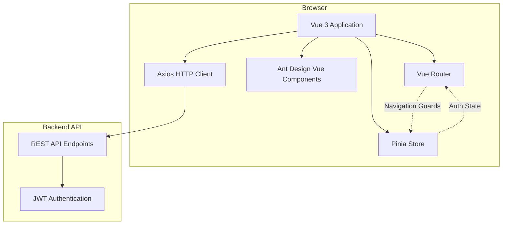

# Design Document: Web Vue3 Refactor

## Overview

本设计文档描述了将 KubeSwitch web 界面从 React 19 + Ant Design 6 重构为 Vue 3 + Ant Design Vue 的技术方案。重构将保持所有现有功能不变，采用 Vue 3 Composition API、TypeScript、Pinia 状态管理和 Vue Router 实现现代化的前端架构。

### 重构目标

1. **技术栈现代化**：采用 Vue 3 生态系统，提升开发体验和应用性能
2. **功能完整性**：保留所有现有功能，确保用户体验无缝过渡
3. **代码质量**：使用 TypeScript 严格模式，提高代码可维护性
4. **架构优化**：采用组合式 API 和模块化设计，提升代码复用性

### 技术栈对比

| 组件 | React 版本 | Vue 3 版本 |
|------|-----------|-----------|
| 框架 | React 19 | Vue 3 |
| UI 库 | Ant Design 6 | Ant Design Vue 4.x |
| 构建工具 | Vite | Vite |
| 语言 | TypeScript | TypeScript |
| 状态管理 | React Context/Hooks | Pinia |
| 路由 | React Router | Vue Router 4 |
| HTTP 客户端 | Axios/Fetch | Axios |

## Architecture

### 整体架构

应用采用典型的前后端分离架构，前端通过 RESTful API 与后端通信。




### 目录结构

```
src/
├── main.ts                 # 应用入口
├── App.vue                 # 根组件
├── router/
│   ├── index.ts           # 路由配置
│   └── guards.ts          # 导航守卫
├── stores/
│   ├── auth.ts            # 认证状态管理
│   ├── cluster.ts         # 集群状态管理
│   ├── user.ts            # 用户状态管理
│   └── audit.ts           # 审计日志状态管理
├── views/
│   ├── Login.vue          # 登录页面
│   ├── Dashboard.vue      # 仪表板布局
│   ├── clusters/
│   │   ├── ClusterList.vue
│   │   └── ClusterPermissions.vue
│   ├── users/
│   │   ├── UserList.vue
│   │   └── UserPermissions.vue
│   └── audit/
│       └── AuditLog.vue
├── components/
│   ├── layout/
│   │   ├── AppLayout.vue
│   │   ├── Sidebar.vue
│   │   └── Header.vue
│   └── common/
│       ├── KubeconfigModal.vue
│       ├── PasswordModal.vue
│       └── ConfirmDialog.vue
├── composables/
│   ├── useAuth.ts         # 认证逻辑复用
│   ├── useApi.ts          # API 调用封装
│   └── usePermission.ts   # 权限检查
├── api/
│   ├── client.ts          # Axios 实例配置
│   ├── auth.ts            # 认证 API
│   ├── clusters.ts        # 集群 API
│   ├── users.ts           # 用户 API
│   └── audit.ts           # 审计 API
├── types/
│   ├── auth.ts            # 认证类型定义
│   ├── cluster.ts         # 集群类型定义
│   ├── user.ts            # 用户类型定义
│   └── api.ts             # API 响应类型
└── utils/
    ├── storage.ts         # 本地存储工具
    ├── token.ts           # Token 管理
    └── validators.ts      # 表单验证
```

### 架构层次

1. **视图层（Views）**：页面级组件，对应路由
2. **组件层（Components）**：可复用的 UI 组件
3. **组合式函数层（Composables）**：业务逻辑复用
4. **状态管理层（Stores）**：全局状态管理
5. **API 层（API）**：后端接口封装
6. **工具层（Utils）**：通用工具函数

## Components and Interfaces

### 核心组件

#### 1. 认证系统

**AuthStore (Pinia Store)**
```typescript
interface AuthState {
  token: string | null
  user: User | null
  isAuthenticated: boolean
  isAdmin: boolean
}

interface AuthStore {
  // State
  state: AuthState
  
  // Getters
  getToken: () => string | null
  getCurrentUser: () => User | null
  checkIsAdmin: () => boolean
  
  // Actions
  login: (username: string, password: string) => Promise<void>
  logout: () => Promise<void>
  refreshUser: () => Promise<void>
  updatePassword: (oldPassword: string, newPassword: string) => Promise<void>
}
```

**useAuth Composable**
```typescript
interface UseAuth {
  isAuthenticated: ComputedRef<boolean>
  isAdmin: ComputedRef<boolean>
  currentUser: ComputedRef<User | null>
  login: (username: string, password: string) => Promise<void>
  logout: () => Promise<void>
}
```

#### 2. 路由系统

**Router Configuration**
```typescript
interface RouteConfig {
  path: string
  name: string
  component: Component
  meta?: {
    requiresAuth?: boolean
    requiresAdmin?: boolean
    title?: string
  }
}
```

**Navigation Guard**
```typescript
router.beforeEach((to, from, next) => {
  const authStore = useAuthStore()
  
  if (to.meta.requiresAuth && !authStore.isAuthenticated) {
    next({ name: 'Login' })
  } else if (to.meta.requiresAdmin && !authStore.isAdmin) {
    next({ name: 'Dashboard' })
  } else {
    next()
  }
})
```


#### 3. 集群管理

**ClusterStore (Pinia Store)**
```typescript
interface ClusterState {
  clusters: Cluster[]
  loading: boolean
  selectedCluster: Cluster | null
}

interface ClusterStore {
  // State
  state: ClusterState
  
  // Getters
  getClusters: () => Cluster[]
  getClusterById: (id: string) => Cluster | undefined
  
  // Actions
  fetchClusters: () => Promise<void>
  createCluster: (cluster: CreateClusterDto) => Promise<void>
  deleteCluster: (id: string) => Promise<void>
  getKubeconfig: (id: string) => Promise<string>
  importKubeconfig: (id: string, file: File) => Promise<void>
  fetchClusterPermissions: (id: string) => Promise<Permission[]>
  updateClusterPermissions: (id: string, permissions: Permission[]) => Promise<void>
}
```

#### 4. 用户管理

**UserStore (Pinia Store)**
```typescript
interface UserState {
  users: User[]
  loading: boolean
}

interface UserStore {
  // State
  state: UserState
  
  // Getters
  getUsers: () => User[]
  getUserById: (id: string) => User | undefined
  
  // Actions
  fetchUsers: () => Promise<void>
  createUser: (user: CreateUserDto) => Promise<void>
  deleteUser: (id: string) => Promise<void>
  resetPassword: (id: string) => Promise<string>
  updateUserRole: (id: string, role: UserRole) => Promise<void>
  fetchUserPermissions: (id: string) => Promise<Permission[]>
  updateUserPermissions: (id: string, permissions: Permission[]) => Promise<void>
}
```

#### 5. HTTP 客户端

**Axios Instance Configuration**
```typescript
const apiClient = axios.create({
  baseURL: import.meta.env.VITE_API_BASE_URL || '/api',
  timeout: 10000,
  headers: {
    'Content-Type': 'application/json'
  }
})

// Request Interceptor - 添加 JWT Token
apiClient.interceptors.request.use(
  (config) => {
    const token = getToken()
    if (token) {
      config.headers.Authorization = `Bearer ${token}`
    }
    return config
  },
  (error) => Promise.reject(error)
)

// Response Interceptor - 处理 401 错误
apiClient.interceptors.response.use(
  (response) => response,
  (error) => {
    if (error.response?.status === 401) {
      const authStore = useAuthStore()
      authStore.logout()
      router.push({ name: 'Login' })
    }
    return Promise.reject(error)
  }
)
```

### 组件通信模式

1. **父子组件通信**：Props down, Events up
2. **跨组件通信**：Pinia Store
3. **兄弟组件通信**：通过共享的 Pinia Store
4. **全局事件**：使用 mitt 或 Vue 3 的 provide/inject

## Data Models

### 类型定义

#### User
```typescript
interface User {
  id: string
  username: string
  role: UserRole
  createdAt: string
  updatedAt: string
}

enum UserRole {
  ADMIN = 'admin',
  USER = 'user'
}

interface CreateUserDto {
  username: string
  password: string
  role: UserRole
}
```

#### Cluster
```typescript
interface Cluster {
  id: string
  name: string
  description?: string
  apiServer: string
  createdAt: string
  updatedAt: string
}

interface CreateClusterDto {
  name: string
  description?: string
  apiServer: string
  kubeconfig: string
}
```

#### Permission
```typescript
interface Permission {
  userId: string
  clusterId: string
  username?: string
  clusterName?: string
  grantedAt: string
}
```

#### AuditLog
```typescript
interface AuditLog {
  id: string
  userId: string
  username: string
  action: string
  resource: string
  resourceId?: string
  timestamp: string
  details?: Record<string, any>
}
```

#### API Response
```typescript
interface ApiResponse<T> {
  success: boolean
  data?: T
  message?: string
  error?: string
}

interface PaginatedResponse<T> {
  items: T[]
  total: number
  page: number
  pageSize: number
}
```

### 状态持久化

使用 `pinia-plugin-persistedstate` 插件持久化认证状态：

```typescript
import { createPinia } from 'pinia'
import piniaPluginPersistedstate from 'pinia-plugin-persistedstate'

const pinia = createPinia()
pinia.use(piniaPluginPersistedstate)

// 在 AuthStore 中配置
export const useAuthStore = defineStore('auth', {
  state: () => ({ /* ... */ }),
  actions: { /* ... */ },
  persist: {
    key: 'kubeswitch-auth',
    storage: localStorage,
    paths: ['token', 'user']
  }
})
```


## Correctness Properties

*属性（Property）是系统在所有有效执行中都应该保持为真的特征或行为——本质上是关于系统应该做什么的形式化陈述。属性作为人类可读规范和机器可验证正确性保证之间的桥梁。*

基于需求文档中的验收标准，我们定义以下正确性属性。这些属性将通过属性测试（Property-Based Testing）进行验证，确保系统在各种输入和状态下的正确行为。

### 认证和授权属性

**Property 1: 未认证访问重定向**
*对于任何*需要认证的路由，当用户未认证时访问，系统应该重定向到登录页面
**Validates: Requirements 1.1**

**Property 2: 无效凭证错误处理**
*对于任何*无效的用户名和密码组合，登录操作应该失败并显示错误消息，且不发生页面导航
**Validates: Requirements 1.4**

**Property 3: 401 错误全局处理**
*对于任何*API 请求返回 401 未授权错误，系统应该清除 JWT Token 并重定向到登录页面
**Validates: Requirements 1.7, 12.5**

**Property 4: 认证请求包含 Token**
*对于任何*需要认证的 API 请求，HTTP 请求头应该包含有效的 JWT Token
**Validates: Requirements 9.7**

### 数据管理属性

**Property 5: 集群列表数据显示**
*对于任何*从 API 返回的集群数据集，系统应该在集群列表页面正确显示所有集群
**Validates: Requirements 2.1**

**Property 6: 集群创建操作**
*对于任何*有效的集群数据（管理员权限下），提交创建操作应该调用 POST /api/clusters 并传递正确的数据
**Validates: Requirements 2.3**

**Property 7: 集群删除操作**
*对于任何*集群 ID（管理员权限下），确认删除操作应该调用 DELETE /api/clusters/:id
**Validates: Requirements 2.5**

**Property 8: 数据变更后列表刷新**
*对于任何*成功的创建、删除或修改操作，相关的数据列表应该自动刷新以反映最新状态
**Validates: Requirements 2.6, 5.5, 7.4**

### Kubeconfig 操作属性

**Property 9: Kubeconfig 查看操作**
*对于任何*集群 ID，点击查看 Kubeconfig 应该调用 GET /api/clusters/:id/config 并在模态框中显示返回的配置内容
**Validates: Requirements 3.1**

**Property 10: Kubeconfig 复制操作**
*对于任何*Kubeconfig 内容，点击复制按钮应该将内容复制到剪贴板并显示成功提示
**Validates: Requirements 3.2**

**Property 11: Kubeconfig 导出操作**
*对于任何*Kubeconfig 内容，点击导出按钮应该触发文件下载
**Validates: Requirements 3.3**

**Property 12: Kubeconfig 导入操作**
*对于任何*有效的 Kubeconfig 文件（管理员权限下），上传操作应该调用 POST /api/clusters/:id/import
**Validates: Requirements 3.5**

**Property 13: Kubeconfig 操作错误处理**
*对于任何*失败的 Kubeconfig 操作，系统应该显示用户友好的错误消息
**Validates: Requirements 3.6**

### 用户管理属性

**Property 14: 用户列表数据显示**
*对于任何*从 API 返回的用户数据集（管理员权限下），系统应该在用户管理页面正确显示所有用户及其角色
**Validates: Requirements 4.1, 7.1**

**Property 15: 用户创建操作**
*对于任何*有效的用户数据（管理员权限下），提交创建操作应该调用 POST /api/users 并传递正确的数据
**Validates: Requirements 4.3**

**Property 16: 非管理员用户删除**
*对于任何*非管理员角色的用户（管理员权限下），确认删除操作应该调用 DELETE /api/users/:id
**Validates: Requirements 4.5**

**Property 17: 管理员用户删除保护**
*对于任何*管理员角色的用户，删除操作应该被阻止并显示错误消息
**Validates: Requirements 4.6**

### 权限管理属性

**Property 18: 权限列表查询**
*对于任何*集群或用户 ID（管理员权限下），查看权限应该调用相应的 API 并显示权限列表
**Validates: Requirements 5.1, 5.3**

**Property 19: 权限授予操作**
*对于任何*用户和集群的组合（管理员权限下），授予权限操作应该调用相应的 API 并传递正确的数据
**Validates: Requirements 5.2, 5.4**

### 密码管理属性

**Property 20: 用户密码修改**
*对于任何*有效的旧密码和新密码组合，密码修改操作应该调用 POST /api/my/password
**Validates: Requirements 6.2**

**Property 21: 密码错误处理**
*对于任何*错误的旧密码，密码修改操作应该失败并显示错误消息
**Validates: Requirements 6.4**

**Property 22: 管理员密码重置**
*对于任何*用户 ID（管理员权限下），密码重置操作应该调用 POST /api/users/:id/password
**Validates: Requirements 6.5**

### 角色管理属性

**Property 23: 用户角色修改**
*对于任何*用户 ID 和有效的角色值（管理员权限下），角色修改操作应该调用 POST /api/users/:id/role
**Validates: Requirements 7.3**

### 审计日志属性

**Property 24: 审计日志数据显示**
*对于任何*从 API 返回的审计日志数据集（管理员权限下），系统应该显示所有必需字段（时间、用户、操作类型、详情）
**Validates: Requirements 8.1, 8.2**

**Property 25: 审计日志分页**
*对于任何*超过页面大小的审计日志数据集，系统应该提供分页功能
**Validates: Requirements 8.3**

### UI/UX 属性

**Property 26: 操作反馈机制**
*对于任何*用户操作（成功或失败），系统应该提供适当的视觉反馈（成功提示、错误消息或加载状态）
**Validates: Requirements 10.6**

**Property 27: 响应式表格滚动**
*对于任何*表格组件，在小屏幕视口下应该支持横向滚动
**Validates: Requirements 11.4**

**Property 28: 响应式表单可用性**
*对于任何*表单组件，在小屏幕视口下应该保持可用性（所有字段可见且可操作）
**Validates: Requirements 11.5**

### 错误处理属性

**Property 29: API 错误消息显示**
*对于任何*失败的 API 请求，系统应该显示用户友好的错误消息
**Validates: Requirements 12.1**

**Property 30: 表单验证错误显示**
*对于任何*无效的表单输入，系统应该在相应字段下显示验证错误消息
**Validates: Requirements 12.3**

**Property 31: 全局错误处理**
*对于任何*未捕获的错误，系统应该显示通用错误消息并记录错误到控制台
**Validates: Requirements 12.4**

### 性能属性

**Property 32: API 响应缓存**
*对于任何*相同的 API 请求（在缓存有效期内），系统应该使用缓存数据而不是发起新的网络请求
**Validates: Requirements 13.4**

### 安全属性

**Property 33: 用户输入验证**
*对于任何*用户输入，系统应该进行验证和清理，拒绝无效或危险的输入
**Validates: Requirements 14.3**

**Property 34: 敏感信息保护**
*对于任何*URL 参数和日志输出，系统不应该包含敏感信息（密码、Token 等）
**Validates: Requirements 14.5**

### 可访问性属性

**Property 35: ARIA 标签完整性**
*对于任何*交互元素（按钮、链接、表单控件），应该提供适当的 ARIA 标签
**Validates: Requirements 15.1**

**Property 36: 键盘导航支持**
*对于任何*交互元素，应该支持键盘操作（Tab、Enter、Escape 等）
**Validates: Requirements 15.2**

**Property 37: 图像替代文本**
*对于任何*图像和图标元素，应该提供描述性的替代文本
**Validates: Requirements 15.4**

**Property 38: 表单标签关联**
*对于任何*表单字段，应该有明确关联的标签元素
**Validates: Requirements 15.5**

### 国际化属性

**Property 39: 文本国际化**
*对于任何*组件中的用户界面文本，应该使用国际化函数而非硬编码字符串
**Validates: Requirements 16.2**

**Property 40: 语言切换响应**
*对于任何*语言切换操作，所有界面文本应该立即更新为选定语言
**Validates: Requirements 16.5**


## Error Handling

### 错误分类

#### 1. 网络错误
- **连接失败**：无法连接到后端 API
- **超时**：请求超过配置的超时时间
- **处理方式**：显示网络错误提示，提供重试选项

#### 2. API 错误
- **400 Bad Request**：请求参数错误，显示具体的验证错误
- **401 Unauthorized**：未授权，清除 Token 并重定向到登录页
- **403 Forbidden**：权限不足，显示权限错误提示
- **404 Not Found**：资源不存在，显示资源未找到提示
- **500 Internal Server Error**：服务器错误，显示通用错误消息

#### 3. 表单验证错误
- **必填字段**：字段为空时显示"此字段为必填项"
- **格式错误**：不符合格式要求时显示具体的格式说明
- **长度限制**：超出长度限制时显示允许的长度范围

#### 4. 业务逻辑错误
- **重复操作**：尝试创建已存在的资源
- **依赖冲突**：删除被其他资源依赖的对象
- **权限限制**：普通用户尝试执行管理员操作

### 错误处理实现

#### 全局错误处理器

```typescript
// Global error handler
app.config.errorHandler = (err, instance, info) => {
  console.error('Global error:', err, info)
  
  // 显示用户友好的错误消息
  message.error('发生了一个错误，请稍后重试')
  
  // 可选：发送错误到监控服务
  // errorReportingService.report(err, { instance, info })
}
```

#### Axios 错误拦截器

```typescript
apiClient.interceptors.response.use(
  (response) => response,
  (error) => {
    const { response } = error
    
    if (!response) {
      // 网络错误
      message.error('网络连接失败，请检查您的网络设置')
      return Promise.reject(error)
    }
    
    switch (response.status) {
      case 400:
        // 显示具体的验证错误
        const errors = response.data.errors || {}
        Object.keys(errors).forEach(key => {
          message.error(`${key}: ${errors[key]}`)
        })
        break
        
      case 401:
        // 清除认证信息并重定向
        const authStore = useAuthStore()
        authStore.logout()
        router.push({ name: 'Login' })
        message.error('登录已过期，请重新登录')
        break
        
      case 403:
        message.error('您没有权限执行此操作')
        break
        
      case 404:
        message.error('请求的资源不存在')
        break
        
      case 500:
        message.error('服务器错误，请稍后重试')
        break
        
      default:
        message.error(response.data.message || '操作失败')
    }
    
    return Promise.reject(error)
  }
)
```

#### 组件级错误处理

```typescript
// 在组件中使用 try-catch
const handleSubmit = async () => {
  try {
    loading.value = true
    await clusterStore.createCluster(formData.value)
    message.success('集群创建成功')
    router.push({ name: 'ClusterList' })
  } catch (error) {
    // 错误已由全局拦截器处理
    console.error('Failed to create cluster:', error)
  } finally {
    loading.value = false
  }
}
```

### 错误恢复策略

1. **自动重试**：对于临时性网络错误，自动重试最多 3 次
2. **降级处理**：当某个功能不可用时，提供基本功能
3. **状态恢复**：错误发生后，确保应用状态保持一致
4. **用户引导**：提供明确的错误信息和解决建议

## Testing Strategy

### 测试方法论

本项目采用双重测试策略，结合单元测试和属性测试，确保全面的代码覆盖和正确性验证。

#### 单元测试（Unit Tests）
- **目的**：验证特定示例、边缘情况和错误条件
- **工具**：Vitest + Vue Test Utils
- **覆盖范围**：
  - 组件渲染和交互
  - 工具函数的具体行为
  - 边缘情况和错误处理
  - 集成点验证

#### 属性测试（Property-Based Tests）
- **目的**：验证在所有输入下都成立的通用属性
- **工具**：fast-check（JavaScript 属性测试库）
- **配置**：每个属性测试至少运行 100 次迭代
- **覆盖范围**：
  - 数据转换的不变性
  - API 调用的正确性
  - 状态管理的一致性
  - 输入验证的完整性

### 测试组织结构

```
tests/
├── unit/
│   ├── components/
│   │   ├── Login.spec.ts
│   │   ├── ClusterList.spec.ts
│   │   └── UserList.spec.ts
│   ├── stores/
│   │   ├── auth.spec.ts
│   │   ├── cluster.spec.ts
│   │   └── user.spec.ts
│   ├── composables/
│   │   ├── useAuth.spec.ts
│   │   └── useApi.spec.ts
│   └── utils/
│       ├── validators.spec.ts
│       └── token.spec.ts
├── properties/
│   ├── auth.properties.spec.ts
│   ├── cluster.properties.spec.ts
│   ├── user.properties.spec.ts
│   ├── permission.properties.spec.ts
│   └── ui.properties.spec.ts
└── e2e/
    ├── login.spec.ts
    ├── cluster-management.spec.ts
    └── user-management.spec.ts
```

### 属性测试标注格式

每个属性测试必须使用注释标注其对应的设计文档属性：

```typescript
// Feature: web-vue3-refactor, Property 1: 未认证访问重定向
test('unauthenticated access redirects to login', () => {
  fc.assert(
    fc.property(
      fc.string(), // 生成随机路由路径
      (routePath) => {
        // 测试逻辑
      }
    ),
    { numRuns: 100 }
  )
})
```

### 测试覆盖率目标

- **整体代码覆盖率**：≥ 80%
- **关键业务逻辑**：≥ 90%
- **工具函数**：100%
- **组件**：≥ 75%

### 测试执行

```bash
# 运行所有测试
npm run test

# 运行单元测试
npm run test:unit

# 运行属性测试
npm run test:properties

# 运行 E2E 测试
npm run test:e2e

# 生成覆盖率报告
npm run test:coverage
```

### Mock 策略

#### API Mock
使用 MSW (Mock Service Worker) 模拟 API 响应：

```typescript
import { rest } from 'msw'
import { setupServer } from 'msw/node'

const server = setupServer(
  rest.post('/api/login', (req, res, ctx) => {
    return res(
      ctx.json({
        token: 'mock-jwt-token',
        user: { id: '1', username: 'test', role: 'admin' }
      })
    )
  })
)

beforeAll(() => server.listen())
afterEach(() => server.resetHandlers())
afterAll(() => server.close())
```

#### Store Mock
使用 Pinia 的测试工具创建隔离的 store 实例：

```typescript
import { setActivePinia, createPinia } from 'pinia'

beforeEach(() => {
  setActivePinia(createPinia())
})
```

### 持续集成

测试应该在以下情况下自动运行：
1. 每次代码提交（pre-commit hook）
2. Pull Request 创建或更新
3. 合并到主分支之前
4. 定期的夜间构建

## Implementation Notes

### 迁移策略

#### 阶段 1：项目初始化（1-2 天）
1. 创建 Vue 3 + Vite 项目
2. 配置 TypeScript、ESLint、Prettier
3. 安装 Ant Design Vue、Vue Router、Pinia
4. 设置项目目录结构

#### 阶段 2：核心基础设施（3-5 天）
1. 实现 Axios 客户端和拦截器
2. 创建 Pinia stores（auth, cluster, user, audit）
3. 配置 Vue Router 和导航守卫
4. 实现认证流程（登录、登出、Token 管理）

#### 阶段 3：布局和通用组件（2-3 天）
1. 创建应用布局（侧边栏、顶部栏）
2. 实现通用组件（模态框、确认对话框等）
3. 配置主题和样式

#### 阶段 4：功能页面实现（10-15 天）
1. 登录页面
2. 集群管理页面
3. 用户管理页面
4. 权限管理功能
5. 审计日志页面
6. 个人设置页面

#### 阶段 5：测试和优化（5-7 天）
1. 编写单元测试
2. 编写属性测试
3. 性能优化
4. 可访问性改进
5. 国际化实现

#### 阶段 6：部署和文档（2-3 天）
1. 配置生产构建
2. Docker 镜像构建
3. 编写部署文档
4. 用户手册更新

### 技术债务和风险

#### 已知限制
1. **浏览器兼容性**：仅支持现代浏览器（Chrome、Firefox、Safari、Edge 最新版本）
2. **离线支持**：当前版本不支持离线模式
3. **实时更新**：不支持 WebSocket 实时推送，需要手动刷新

#### 潜在风险
1. **API 兼容性**：需要确保后端 API 与前端期望一致
2. **性能问题**：大量数据时可能需要虚拟滚动优化
3. **安全性**：Token 存储在 localStorage 可能存在 XSS 风险

#### 缓解措施
1. 与后端团队密切协作，确保 API 契约
2. 实现虚拟滚动和分页加载
3. 实施严格的 CSP（Content Security Policy）
4. 定期进行安全审计

### 性能优化建议

1. **代码分割**：使用 Vue Router 的懒加载
2. **组件懒加载**：大型组件使用 `defineAsyncComponent`
3. **图片优化**：使用 WebP 格式，实现懒加载
4. **缓存策略**：合理使用 HTTP 缓存和应用级缓存
5. **Tree Shaking**：确保未使用的代码被移除
6. **压缩**：启用 Gzip/Brotli 压缩

### 开发工具推荐

1. **IDE**：VS Code + Volar 插件
2. **调试**：Vue DevTools
3. **API 测试**：Postman 或 Insomnia
4. **性能分析**：Chrome DevTools Performance
5. **可访问性检查**：axe DevTools

## References

### 官方文档
- [Vue 3 官方文档](https://vuejs.org/)
- [Ant Design Vue 文档](https://antdv.com/)
- [Pinia 文档](https://pinia.vuejs.org/)
- [Vue Router 文档](https://router.vuejs.org/)
- [Vite 文档](https://vitejs.dev/)

### 最佳实践
- [Vue 3 风格指南](https://vuejs.org/style-guide/)
- [TypeScript 最佳实践](https://www.typescriptlang.org/docs/handbook/declaration-files/do-s-and-don-ts.html)
- [Composition API 最佳实践](https://vuejs.org/guide/reusability/composables.html)

### 测试资源
- [Vitest 文档](https://vitest.dev/)
- [Vue Test Utils 文档](https://test-utils.vuejs.org/)
- [fast-check 文档](https://fast-check.dev/)
- [MSW 文档](https://mswjs.io/)

### 安全资源
- [OWASP Top 10](https://owasp.org/www-project-top-ten/)
- [JWT 最佳实践](https://tools.ietf.org/html/rfc8725)
- [Web 安全指南](https://developer.mozilla.org/en-US/docs/Web/Security)
